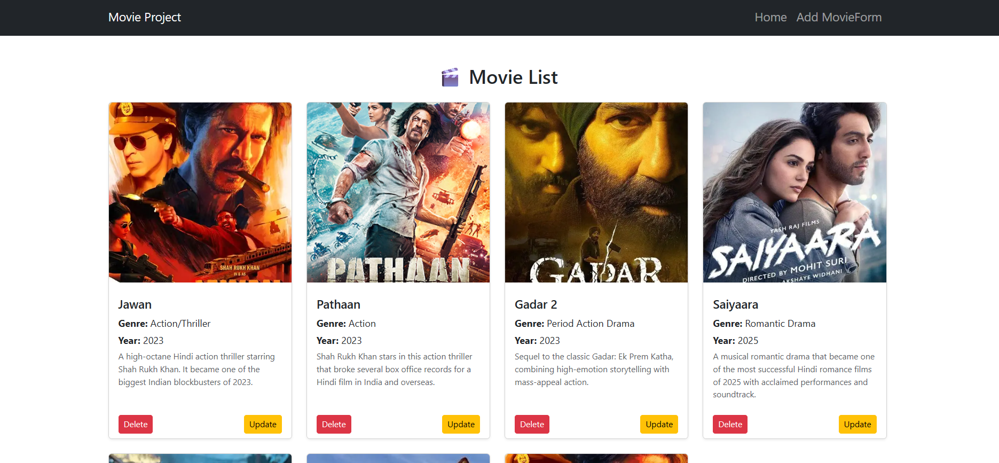

# MERN Stack Movie Project

> A simple movie management application to list, add, and update movies.

## Table of Contents
- [About](#about)
- [Features](#features)
- [Screenshots](#screenshots)
- [Installation](#installation)
- [Usage](#usage)
- [Technologies](#technologies)
- [Contributing](#contributing)
- [License](#license)

## About
This project allows users to manage a collection of movies.  
Users can:
- View all movies on the home screen.
- Add new movies.
- Update existing movie details.

## Features
- Home Screen with movie list
- Add Movie screen
- Update Movie screen
- Image support for each movie

## Screenshots

### Home Screen

### Add Movie

### Update Movie

